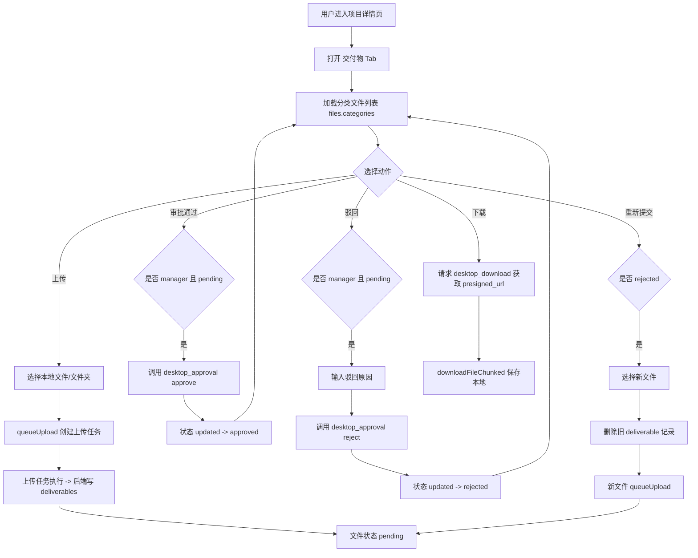

# 桌面端（CRM Desktop）技术设计说明文档

## 1. 文档目的与范围
本文件用于描述桌面端（Tauri + React/TypeScript）的技术设计与实现边界，覆盖：
- **系统架构**：桌面端、后端API、对象存储（S3）
- **核心模块**：认证、项目详情、交付物（文件）、上传/下载、审批
- **关键数据流**：上传、审批、驳回重提
- **权限模型**：管理员/主管/技术/客户视角（桌面端主要为内部人员）
- **关键接口**：桌面端调用的API约定（请求/响应/错误）

不包含：业务规则的制定与UI视觉规范。

## 2. 总体架构
### 2.1 架构分层
- **UI层（React）**
  - 页面与组件：`desktop/src/pages/*`、`desktop/src/components/*`
  - 状态管理：`desktop/src/stores/*`（例如 auth/permissions/settings）
- **业务层（Hooks/Lib）**
  - 上传队列：`desktop/src/hooks/use-uploader.ts`
  - Tauri能力封装：`desktop/src/lib/tauri.ts`（下载、文件元信息、预览等）
- **服务层（HTTP API）**
  - 后端PHP API：`/index/api/*.php` 通过 `fetch` 调用
  - 认证：`Authorization: Bearer <token>`
- **存储层**
  - 数据库：项目、客户、deliverables（交付物）、上传任务、审批状态等
  - 对象存储：S3（文件真实存放）

### 2.2 关键交互原则
- **桌面端不直接处理S3鉴权**：通过后端API拿 presigned_url 或由后端代操作。
- **大文件上传走分片/队列**：由桌面端上传队列进行任务调度与并发控制。
- **审批状态以数据库为准**：前端只展示并触发动作。

## 3. 核心模块设计

### 3.1 认证与权限
#### 3.1.1 认证
- 登录后获得 `token`（JWT或类似令牌），保存于 `auth store`。
- 后续 API 调用统一携带：
  - `Authorization: Bearer ${token}`

#### 3.1.2 权限（概念模型）
- **管理员/主管（manager）**
  - 交付物审批：通过/驳回
  - 可管理文件（重命名/删除）范围更大
- **上传者（uploader）**
  - 在 `pending` 或 `rejected` 状态可管理（重命名/删除/重新提交）
- **其他角色**
  - 仅查看/下载（取决于后端权限判定）

前端关键判定入口（示例）：
- `checkIsManager(user?.role)`
- `canManageFile(file)`：结合 uploader_id + approval_status + role

> 注意：最终权限必须由后端再次校验，前端判断仅用于UI展示与交互引导。

### 3.2 项目详情页（ProjectDetailPage）
#### 3.2.1 页面职责
- 展示项目概览、动态表单、交付物、沟通记录、项目记录、财务等 Tab。
- 交付物 Tab：按分类展示（客户文件/作品文件/模型文件），支持树状/列表视图。

#### 3.2.2 数据装载
- `loadProject('files')`：加载项目与交付物数据。
- 文件数据结构（UI侧抽象）：
  - `FileData.categories[categoryName].files[]` 其中包含 `approval_status、uploader_id、file_path/storage_key` 等。

### 3.3 交付物（文件）模块
#### 3.3.1 状态机
- `pending`：待审核
- `approved`：已通过
- `rejected`：已驳回

状态变化：
- 上传新文件 → `pending`
- 管理员通过 → `approved`
- 管理员驳回 → `rejected`
- 上传者重新提交 → 新文件 `pending`（旧记录删除或保留取决于后端策略）

#### 3.3.2 审批（通过/驳回）
- 触发条件：
  - 文件状态为 `pending`
  - 当前用户为 `manager`
- 调用接口：
  - `POST /api/desktop_approval.php?action=approve` body: `{ file_id }`
  - `POST /api/desktop_approval.php?action=reject` body: `{ file_id, reason }`
- 成功后：刷新 files tab（`loadProject('files')`）。

#### 3.3.3 单文件重新提交（rejected）
设计目标：当文件被驳回后，上传者可选择本地新文件替换。
- UI：在 `rejected` 标签旁增加「重新提交」按钮。
- 行为：
  - 选择本地文件（Tauri dialog）
  - 删除旧文件记录（`desktop_file_manage.php`）
  - 将新文件加入上传队列（`use-uploader.queueUpload`）

当前实现策略（前端）：
1. `POST /api/desktop_file_manage.php` `{ action:'delete', id }`
2. `queueUpload(groupCode, assetType, localPath, relPath, projectId)`

> 说明：此实现为“替换式重提”，若业务希望保留历史版本，应改为后端增加 versioning/关联表。

#### 3.3.4 批量重新提交（rejected）
设计目标：项目主管/上传者批量勾选多个 `rejected` 文件，一次性选择多个本地文件重新上传。
- UI：当所选文件中存在 `rejected` 项时显示「批量重新提交(n)」。
- 行为：
  - 选择多个文件（数量允许≠n；前端不强制一一对应）
  - 批量删除旧文件记录
  - 将选择的本地文件逐个加入上传队列

当前实现策略（前端）：
1. 收集 `rejectedSelected` → ids
2. `POST /api/desktop_file_manage.php` `{ action:'batch_delete', ids }`
3. 对 `filePaths` 循环调用 `queueUpload(...)`

> 建议：若需要“严格一一对应”，应改为：
- UI展示映射列表（旧文件名 → 选择的新文件）
- 或按文件名自动匹配。

### 3.4 上传队列（use-uploader）
#### 3.4.1 职责
- 将本地文件转换成上传任务（UploadTask）并写入 sync store
- 控制并发：`maxConcurrentUploads`
- 失败重试/暂停继续（按实现为准）

#### 3.4.2 queueUpload 约定
函数签名：
```ts
queueUpload(
  groupCode: string,
  assetType: 'works' | 'models' | 'customer',
  localPath: string,
  relPath: string,
  projectId?: number
)
```
- `groupCode`：客户/项目分组编码
- `assetType`：对应分类
- `localPath`：本地路径
- `relPath`：相对路径/展示名（通常用文件名）
- `projectId`：关联项目

### 3.5 下载/预览
- 下载流程：
  1. 请求后端获取 `presigned_url`
  2. 使用 `downloadFileChunked()` 保存到用户选择的本地路径
- 预览流程：
  - 依据 `previewFile` 或后端预览url（具体以实现为准）

## 4. 后端接口约定（桌面端关心）
> 以下为桌面端调用层面的“契约”，实际字段以接口返回为准。

### 4.1 文件审批
- `POST /api/desktop_approval.php?action=approve`
  - body: `{ file_id: number }`
  - resp: `{ success: boolean, error?: string }`
- `POST /api/desktop_approval.php?action=reject`
  - body: `{ file_id: number, reason?: string }`
  - resp: `{ success: boolean, error?: string }`

### 4.2 文件管理
- `POST /api/desktop_file_manage.php`
  - delete: `{ action:'delete', id:number }`
  - batch_delete: `{ action:'batch_delete', ids:number[] }`
  - rename: `{ action:'rename', id:number, new_name:string }`
  - delete_by_key/rename_by_key：管理员对未入库文件按 `storage_key` 操作

### 4.3 下载
- `POST /api/desktop_download.php`
  - body: `{ storage_key: string }`
  - resp: `{ success:boolean, data?:{ presigned_url:string } }`

## 5. 数据流（关键用例）
### 5.1 上传 → 审批 → 通过
1. 技术/上传者在交付物里选择文件 → `queueUpload` 创建上传任务
2. 上传任务完成 → 后端写入 deliverables，状态 `pending`
3. 管理员在交付物列表点击「通过」→ 调用 `desktop_approval.php?action=approve`
4. 后端更新 approval_status → `approved`
5. 前端刷新列表

### 5.2 上传 → 驳回 → 重新提交
1. 管理员点击「驳回」并可填原因 → `rejected`
2. 上传者看到 `已驳回` 标签与 `重新提交` 按钮
3. 上传者选择新文件
4. 前端删除旧记录 + 新文件入队上传
5. 新文件回到 `pending`，等待再次审核

### 5.3 批量重新提交
1. 上传者勾选多个 `rejected` 文件
2. 点击「批量重新提交(n)」
3. 选择多个本地文件
4. 批量删除旧记录 + 多文件入队上传

## 6. 异常处理与用户提示
- 网络/权限错误：统一 toast（destructive）提示
- 删除失败：阻断后续上传动作
- 上传队列异常：use-uploader 内 toast + 控制台 log

## 7. 安全与合规
- Token 不写入日志
- 关键操作（删除/审批/驳回）后端必须校验：
  - 用户身份
  - 用户角色
  - 文件归属（project_id）

## 8. 扩展点（建议）
- **版本化交付物**：驳回后不删除旧文件，建立 `deliverable_versions` 表
- **驳回原因展示**：在文件条目下展示最近一次驳回原因
- **批量映射UI**：批量重提时展示“旧文件 → 新文件”映射，避免错配
- **审计日志**：审批/删除/重命名落库，方便追溯

## 9. 技术流程图（Mermaid）
### 9.1 桌面端交付物全流程（技术设计师视角）


