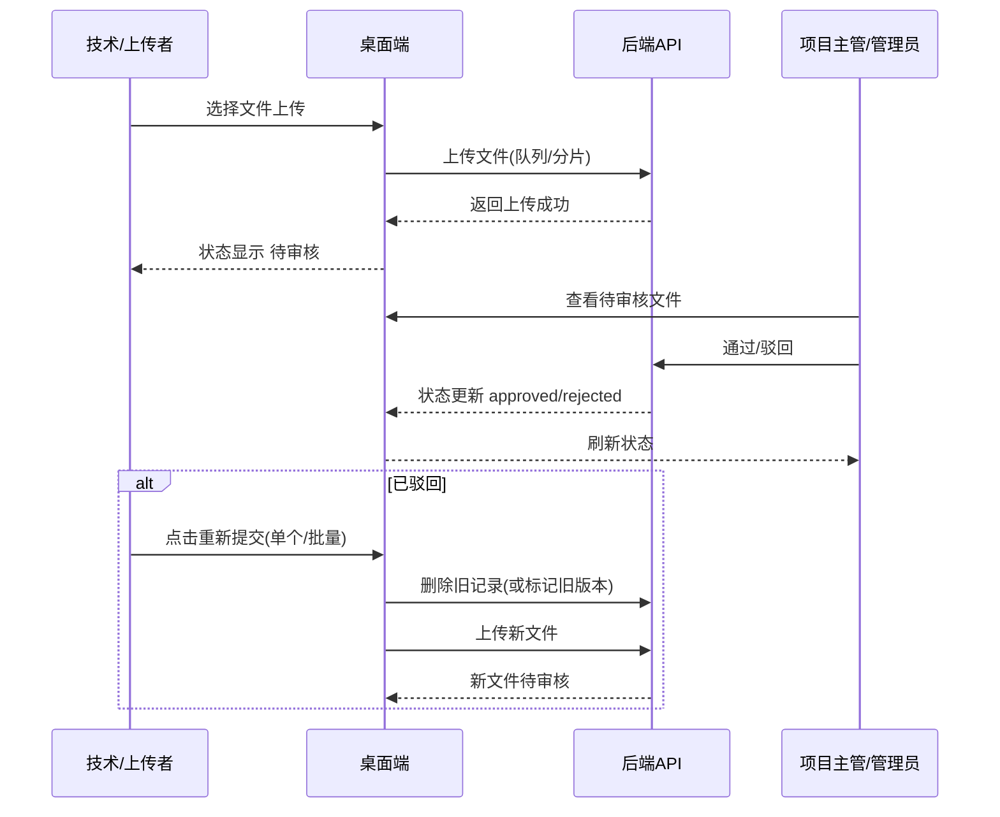

# 桌面端项目文档（交付物 & 审批闭环）

## 1. 业务目标
- 建立项目交付物（文件）管理闭环：上传 → 审核 → 通过/驳回 → 修改 → 再审
- 提升项目主管对交付质量的可控性
- 让技术/上传者在驳回后可以快速替换并重新提交

## 2. 参与角色
- **项目主管/管理员**
  - 审批文件：通过/驳回
  - 对交付质量负责
- **技术/上传者**
  - 上传交付物
  - 根据驳回意见修正后重新提交
- **其他成员（可选）**
  - 查看与下载（取决于权限）

## 3. 文件分类
- 客户文件：客户提供的素材/需求相关文件
- 作品文件：产出的设计/成片/交付物
- 模型文件：模型、源文件或工程文件

## 4. 文件状态定义
- **待审核（pending）**：上传完成后默认状态
- **已通过（approved）**：主管确认可交付
- **已驳回（rejected）**：主管认为需修改并重提

## 5. 审批规则（建议）
- 主管需在驳回时填写原因（可选但建议填写）
- 驳回原因应包含：
  - 不合格点
  - 修改建议
  - 截止时间（如需）

## 6. 重新提交流程
- 单个重提：针对单个驳回文件，选择新文件替换提交
- 批量重提：多个驳回文件一起替换提交

当前实现策略：替换式重提（删除旧记录，新增新文件进入待审核）。

## 7. 关键流程图（Mermaid）

## 8. 验收标准
- 主管能在交付物列表对待审核文件进行通过/驳回
- 驳回后技术侧能看到“重新提交”
- 重新提交后文件重新回到待审核，主管可再次审批
- 批量重提可一次性提交多个文件
